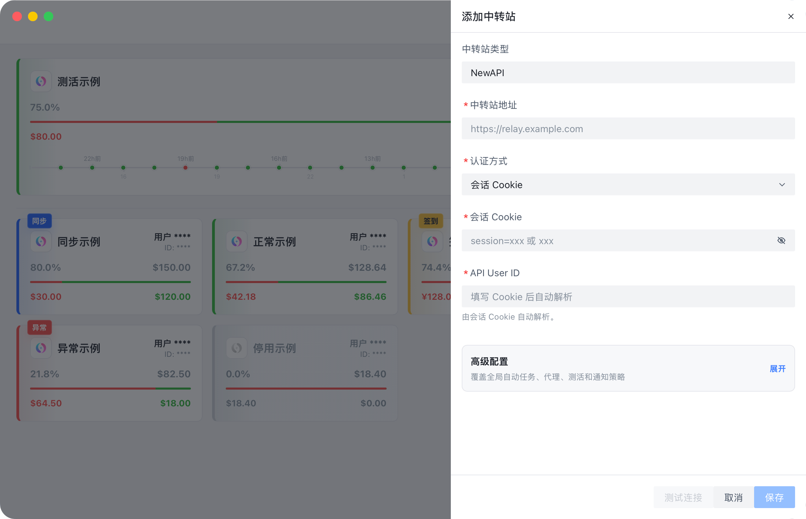
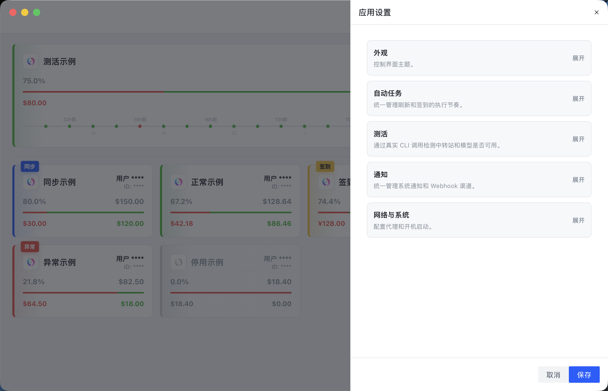
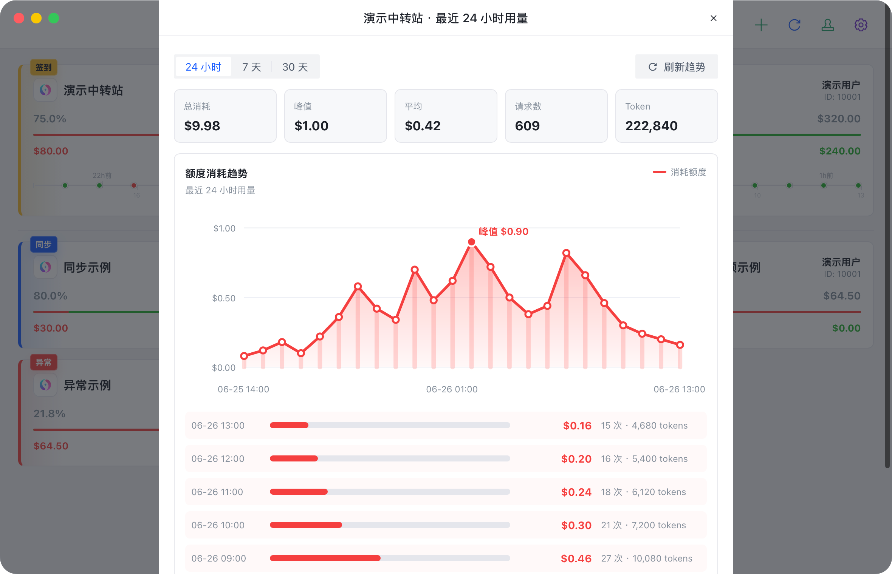
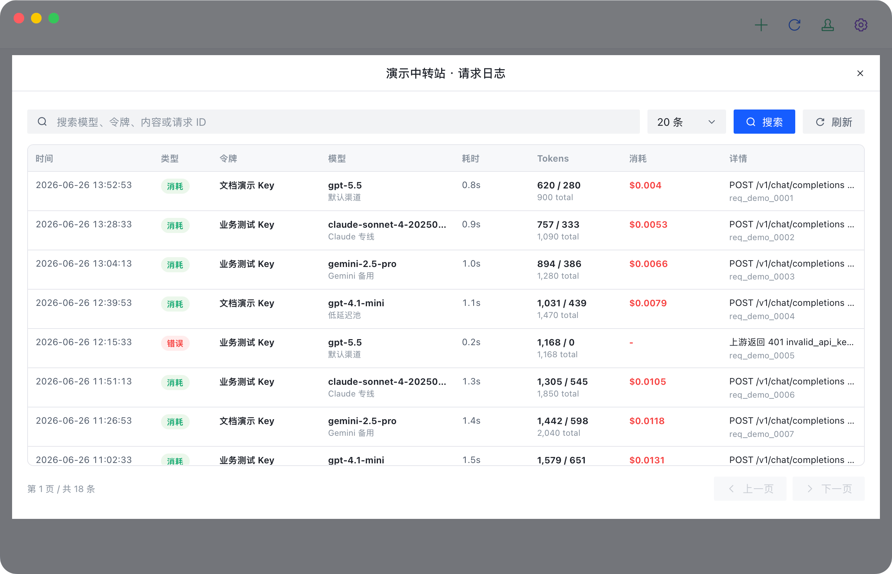
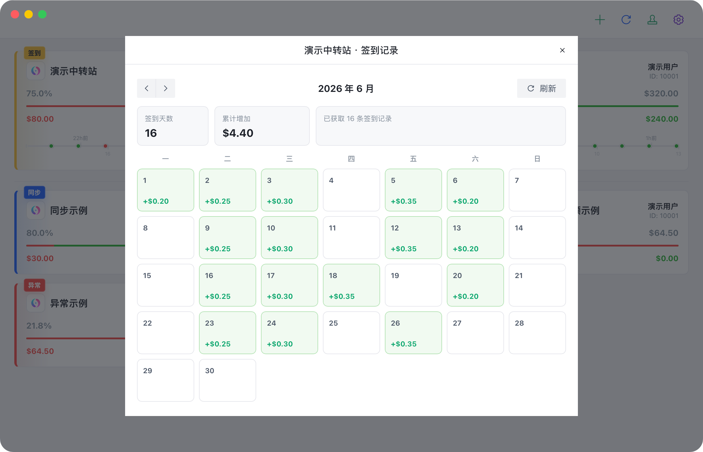

<p align="center">
  
</p>

<h1 align="center">BalanceHub</h1>

<p align="center">
  AI 中转站账号的桌面管理面板。
</p>

<p align="center">
  <a href="https://github.com/NotoChen/BalanceHub/actions/workflows/ci.yml"></a>
  <a href="https://github.com/NotoChen/BalanceHub/actions/workflows/release.yml"></a>
  <a href="https://github.com/NotoChen/BalanceHub/releases/latest"></a>
  
  
</p>

<p align="center">
  <a href="https://notochen.github.io/BalanceHub/">项目主页</a>
  ·
  <a href="https://github.com/NotoChen/BalanceHub/releases/latest">下载</a>
  ·
  <a href="docs/getting-started.md">快速开始</a>
  ·
  <a href="docs/reference.md">功能与架构</a>
  ·
  <a href="CHANGELOG.md">更新记录</a>
  ·
  <a href="https://github.com/NotoChen/BalanceHub/issues">反馈问题</a>
</p>

BalanceHub 用来集中管理 NewAPI 兼容中转站账号。它把余额、签到、用量趋势、请求日志、API Key、Codex / Claude Code 测活这些高频操作放到一个本地桌面应用里，减少在多个中转站后台之间来回切换。

## 为什么需要 BalanceHub

NewAPI 兼容中转站通常各自有独立后台。账号多了之后，余额、签到、API Key、请求日志、用量趋势和模型可用性会分散在多个页面里。BalanceHub 把这些信息收束到本地桌面 App 中，适合长期管理多个中转站账号。

- **集中观察**：余额、额度、账号状态、站点元数据和异常状态集中展示。
- **减少切换**：签到、签到记录、用量趋势、请求日志、API Key 管理都在 App 内完成。
- **贴近 CLI 使用场景**：支持 Codex / Claude Code 的真实 CLI 测活，记录模型、延迟和错误原因。
- **衔接本地工具**：在中转站卡片内临时启动 Codex / Claude Code CLI，也可以把当前配置添加到 CC Switch。
- **本地优先**：账号密码、Cookie、Token、API Key 和中转站配置保存在本机，后端请求由 Tauri / Rust 在本地执行。
- **适合后台运行**：系统托盘、自动刷新、自动签到、自动测活和通知围绕日常挂后台使用设计。

## 适合与边界

BalanceHub 适合已经在使用多个 NewAPI 兼容中转站，并希望把账号观察、日常签到、用量排查和 CLI 可用性验证集中到一个桌面工具里的用户。它不是中转站服务端，也不提供 Web 自部署版本。

当前 UI 只展示 NewAPI 类型；AnyRouter 按 NewAPI 方言兼容处理，不作为独立中转站类型展示。sub2api 尚未接入。仓库只通过 Issues 收集反馈，不接受 Pull Request。

## 界面预览

以下截图均来自真实桌面 App。截图中的中转站名称、用户名称和用户 ID 均为演示数据。

<p>
  
  
</p>
<p>
  
  
</p>
<p>
  
</p>

## 快速开始

1. 下载并打开 [最新版本](https://github.com/NotoChen/BalanceHub/releases/latest)。
2. 点击添加中转站，填写 NewAPI 兼容站点地址。
3. 选择认证方式，优先使用账号密码；已有会话时可选择 Cookie，其次是访问令牌，最后是 API Key。
4. 测试连接并保存，中转站会出现在主面板。
5. 按需开启自动刷新、自动签到、自动测活和通知。
6. 需要临时使用某个中转站时，在卡片快捷操作中选择 Codex / Claude Code，选择工作目录后启动终端。

测活需要真实 API Key，并会消耗中转站额度。CLI 测活请安装独立的 Codex CLI 或 Claude Code CLI；Codex Desktop App 内置二进制不是稳定 CLI 入口，不会作为测活候选。

## 核心能力

| 模块 | 能力 | 适用场景 |
| --- | --- | --- |
| 中转站管理 | 新增、编辑、排序、连接测试、站点探测、认证方式管理。 | 维护多个 NewAPI 兼容站点，快速确认账号状态。 |
| 余额与账单 | 账号额度、API Key 额度、无限额度、用量趋势、请求日志。 | 观察余额变化、排查消耗异常、确认 Key 维度额度。 |
| 签到 | 手动签到、自动签到、签到记录、余额增量识别。 | 处理日常签到，并避免把无余额变化的签到误判为有效收益。 |
| 测活 | Codex / Claude Code CLI 测活、候选 CLI 扫描、时间线记录。 | 判断站点、模型、Key、代理或本机 CLI 是否可用。 |
| 工具衔接 | 临时启动 Codex / Claude Code CLI、添加到 CC Switch。 | 以当前中转站的 API Key、Base URL 和模型临时覆盖 CLI，或把配置交给 CC Switch 管理。 |
| 通知与后台 | 系统通知、Webhook 通知、系统托盘、开机启动、自动调度。 | 长期后台运行，异常时通过桌面或团队工具提醒。 |
| 数据与更新 | 本地配置存储、导入导出、异常写入恢复、Tauri updater 自动更新。 | 本地优先保存敏感信息，并支持跨设备迁移和版本更新。 |

## 技术框架

| 层级 | 技术 | 职责 |
| --- | --- | --- |
| 桌面容器 | Tauri 2 | 窗口、托盘、权限、通知、自动更新和跨平台打包。 |
| 后端 | Rust 2021、tokio、reqwest、serde | NewAPI 请求、调度、存储、通知、测活和 Tauri command。 |
| 前端 | Vue 3、TypeScript、Pinia、Arco Design Vue | App 交互、状态管理、设置面板、弹窗、图表和桌面工具界面。 |
| 构建发布 | Vite、Cargo、GitHub Actions | 本地开发、质量检查、tag 触发的多平台发布包。 |

## 架构概览

```text
Vue 3 UI
  -> composables / Pinia store
    -> Tauri invoke
      -> Rust commands
        -> services/provider_service
          -> providers/newapi_* 访问中转站
          -> services/liveness 执行测活
          -> services/notifications 发送通知
          -> storage.rs 读写本地配置
```

前端负责操作体验和状态呈现；Rust 负责带认证的站点请求、调度、持久化、通知和外部 CLI 调用。这样可以把 Cookie、Token、API Key 留在本机，同时避免浏览器跨域、CSP 和凭据暴露问题。

## 项目结构

```text
.
├── src/                    # Vue 前端：页面、组件、状态、样式和工具函数
├── src-tauri/              # Tauri / Rust 后端：命令、模型、服务、站点适配和存储
├── docs/                   # 使用文档、项目主页和截图资源
├── .github/                # CI、Release、Pages 和 Issue 模板
├── CHANGELOG.md            # 版本更新记录
└── CONTRIBUTING.md         # 本地开发和仓库协作边界
```

更完整的功能定义、技术栈、架构分层和目录说明见 [功能与架构参考](docs/reference.md)。

## 文档

- [快速开始](docs/getting-started.md)
- [中转站配置](docs/provider-config.md)
- [测活配置](docs/liveness.md)
- [功能与架构参考](docs/reference.md)
- [发布与更新](docs/release.md)
- [常见问题](docs/faq.md)

## 常见问题

<details>
<summary><strong>支持哪些中转站？</strong></summary>

当前只在 UI 上支持 NewAPI 兼容中转站。AnyRouter 按 NewAPI 方言兼容处理，不作为独立中转站类型展示。sub2api 尚未接入。

</details>

<details>
<summary><strong>认证方式应该怎么选？</strong></summary>

默认优先级是账号密码 > Cookie > 访问令牌 > API Key。账号密码可以登录并补全后续会话、访问令牌和 API Key；只关心 Key 维度额度时可以使用 API Key。

</details>

<details>
<summary><strong>测活会不会消耗额度？</strong></summary>

会。CLI 测活会通过本机 CLI 向中转站发起真实请求；自动测活首次开启前会要求确认。

</details>

<details>
<summary><strong>为什么不扫描 Codex Desktop App 内置二进制？</strong></summary>

Codex Desktop App 内置二进制属于桌面 App 包内部资源，不是稳定的命令行安装入口。它的路径、权限和运行依赖都可能随 App 更新变化。BalanceHub 只扫描独立安装的 `codex` CLI。

</details>

## 反馈

BalanceHub 当前只通过 [Issues](https://github.com/NotoChen/BalanceHub/issues) 收集问题反馈和功能建议，不接受 Pull Request。项目代码由维护者自行实现和合并。

## 开源协议

BalanceHub 使用 [非商业同源许可证](LICENSE)。

- 禁止商业使用。
- 允许非商业场景下学习、修改和分发。
- 分发修改版或基于本项目的派生作品时，必须公开对应源码，并沿用同一许可证。
