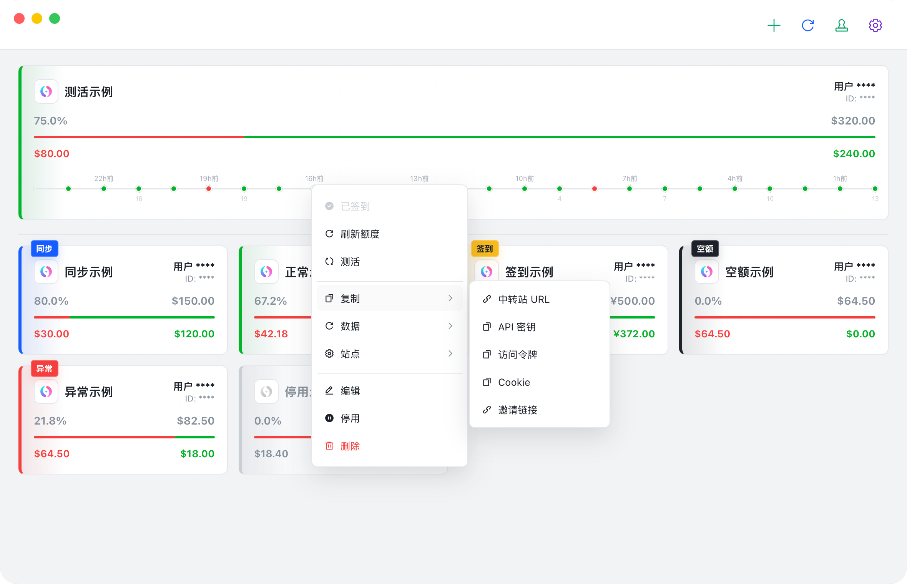

  

<h1 align="center">BalanceHub</h1>

  AI 中转站账号的桌面管理面板。

  
  
  
  

  <a href="https://notochen.github.io/BalanceHub/">项目主页</a>
  ·
  <a href="https://github.com/NotoChen/BalanceHub/releases/latest">下载</a>
  ·
  <a href="CHANGELOG.md">更新记录</a>
  ·
  <a href="https://github.com/NotoChen/BalanceHub/issues">反馈问题</a>

BalanceHub 用来集中管理 NewAPI 兼容中转站账号。它把余额、签到、用量趋势、请求日志、API Key、Codex / Claude Code 测活这些高频操作放到一个本地桌面应用里，减少在多个中转站后台之间来回切换。

## 界面预览

以下截图均来自真实桌面 App。截图中的中转站名称、用户名称和用户 ID 均为演示数据。

  
  

  
  

  
  

## 项目状态

BalanceHub 目前处于早期公开版本阶段。核心桌面端工作流已经可用，后续会继续补齐更多中转站类型、更多运营数据和更完整的发布渠道。

## 反馈

BalanceHub 当前只通过 [Issues](https://github.com/NotoChen/BalanceHub/issues) 收集问题反馈和功能建议，不接受 Pull Request。项目代码由维护者自行实现和合并。

## 开源协议

BalanceHub 使用 [非商业同源许可证](LICENSE)。

- 禁止商业使用。
- 允许非商业场景下学习、修改和分发。
- 分发修改版或基于本项目的派生作品时，必须公开对应源码，并沿用同一许可证。
