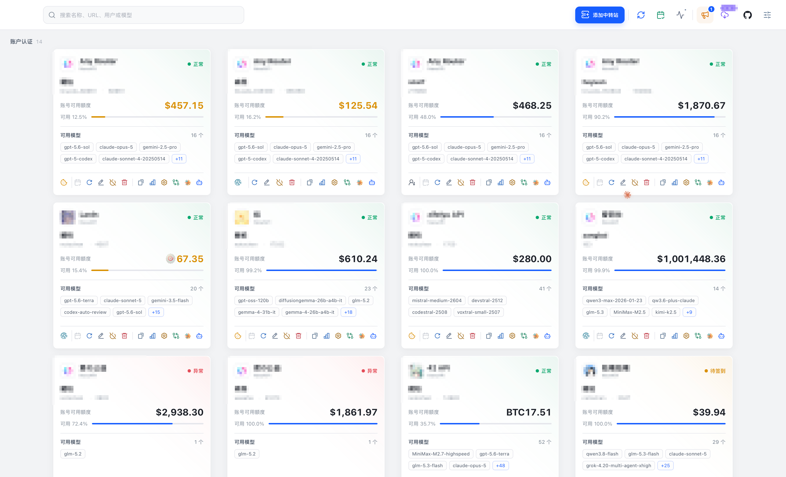
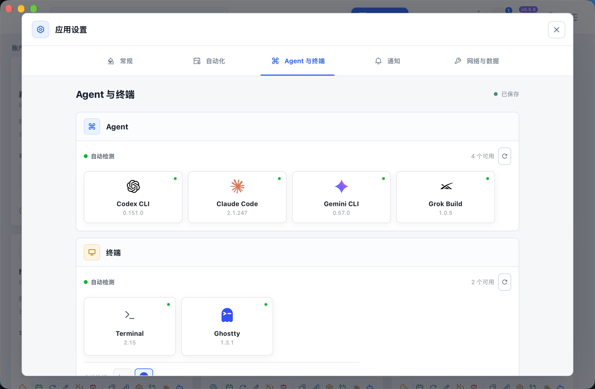
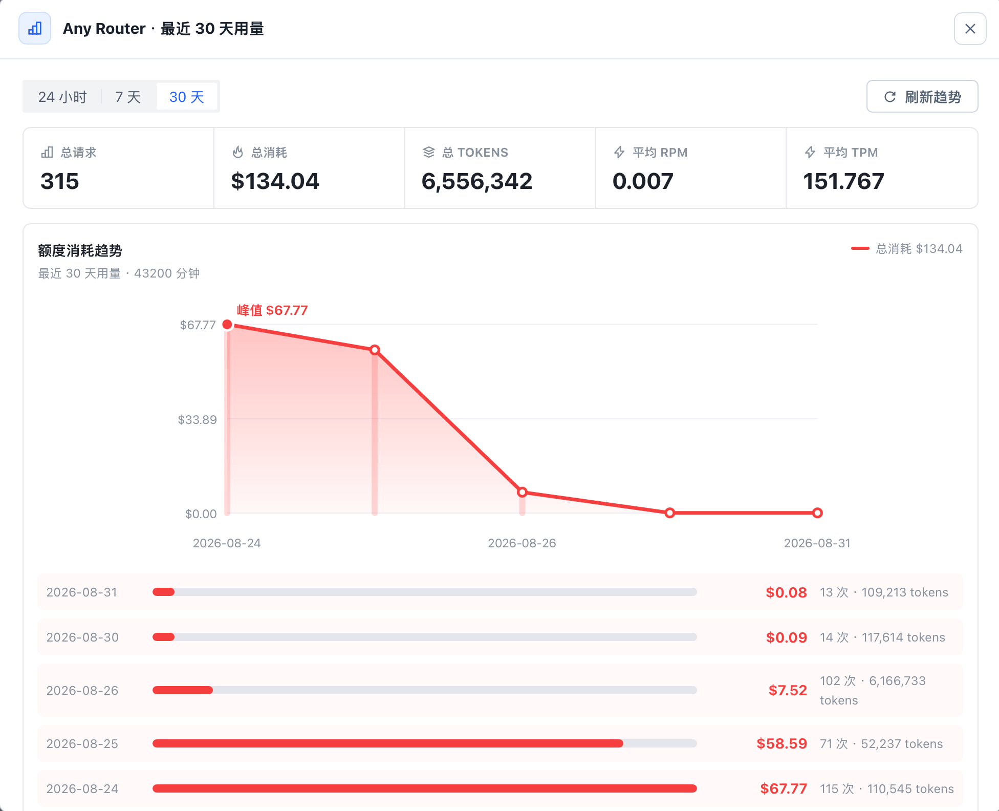
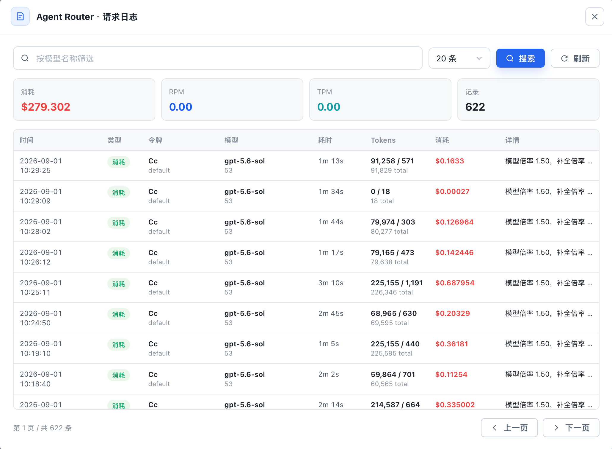
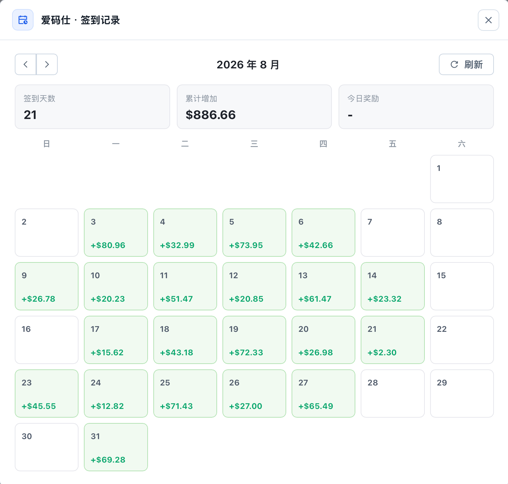

<!--
  BalanceHub README
  截图请放到 docs/assets/screenshots/ 下,文件名如下(单主题、导出时烤圆角+阴影、2x 后压缩):
    overview.png          账号总览主面板(Hero)
    settings.png          设置 · Agent 与终端
    usage-trends.png      用量趋势
    request-logs.png      请求日志
    checkin-records.png   签到记录
  Banner:docs/assets/banner.svg(彩虹渐变 + 矢量图标 + 文字,自包含)
-->

[项目主页](https://notochen.github.io/BalanceHub/) ·
[下载](https://github.com/NotoChen/BalanceHub/releases/latest) ·
[快速开始](docs/getting-started.md) ·
[文档](docs/reference.md) ·
[更新记录](CHANGELOG.md) ·
[反馈](https://github.com/NotoChen/BalanceHub/issues)

## 简介

你手里有好几个 AI 中转站账号,每天在各家后台之间切来切去:看余额、点签到、翻日志,还得惦记某个账号的额度到底还能不能喂给 Claude Code 或 Codex。**BalanceHub 把这些收进一个本地桌面 App。**

和只看余额的工具不同,它**一路做到底**:粘贴地址自动识别协议 → 用你机器上的真实 CLI 验证这个账号能不能跑通 → 直接在卡片里拉起终端接着干活。账号密码、Cookie、Token、API Key 全部留在本机,带认证的请求由 Rust 本地执行。BalanceHub 是本地桌面工具,不是中转站服务端,也不提供 Web 自部署版本。

**● 活跃维护中** · 最新 v0.5.9 · macOS / Windows / Linux(x64 & ARM64)· 基于 Tauri 2 原生构建

**快速跳转:** [30 秒看懂](#30-秒看懂) · [适合谁](#适合谁) · [核心能力](#核心能力) · [选型对比](#选型对比) · [下载与安装](#下载与安装) · [快速开始](#快速开始) · [文档](#文档) · [常见问题](#常见问题)

## 30 秒看懂

1. **添加中转站** — 粘贴站点地址,自动识别 NewAPI / Sub2API / 通用 API 协议并接入,余额随即显示。
2. **一键测活** — 用本机 Codex / Claude Code / Gemini / Grok 发真实请求,确认这个账号真的能跑通。
3. **切进 CLI** — 卡片内用它的 Key 与模型直接拉起终端,还能接续该 Agent 之前的历史会话。

> [!TIP]
> 举个例子:某个账号余额还剩 **$18**,可 Claude Code 一跑就报错。是 Key 失效了?站点挂了?还是本机代理的问题?**测活时间线**直接把它标成「令牌失效」「模型不可用」还是「网络异常」—— 你不用再靠猜、也不用把额度浪费在反复试错上。

## 为什么选 BalanceHub

- **集中观察** — 余额、额度、账号状态、站点元数据与异常状态,多站点一屏展示。
- **减少切换** — 签到、用量趋势、请求日志、API Key 管理全部在应用内完成,不再来回开后台。
- **本地优先** — 账号密码、Cookie、Token、API Key 与站点配置全部保存在本机,请求由 Rust 本地执行。
- **挂后台无感** — 系统托盘、自动刷新、自动签到、自动测活与通知,专为挂后台设计。

## 适合谁

| 适合 | 可能不适合 |
| --- | --- |
| • 同时在用多个 NewAPI / Sub2API / 通用中转站账号 • 日常用 Codex、Claude Code、Gemini CLI、Grok Build 打这些站点 • 靠每日签到攒额度,想自动化、不想漏签 • 希望账号密码 / Token / Key 只留在本机 • 需要长期挂后台,自动刷新与异常通知 | • 只用一个账号,手动看看就够了 • 只想在浏览器里比模型价格(All API Hub 更轻) • 只需给 CLI 切换配置、不管账号(CC Switch 就够) • 想要服务端或 Web 自部署版本 |

## 界面预览

以下截图均来自真实桌面应用,其中的中转站名称、用户名称和用户 ID 均为演示数据。

<table>
  <tr>
    <td width="50%"> <b>设置 · Agent 与终端</b> — 自动检测 Codex / Claude Code / Gemini / Grok 与本地终端,一处配置</td>
    <td width="50%"> <b>用量趋势</b> — 近 30 天请求量、消耗与 Token 趋势,自动标出峰值</td>
  </tr>
  <tr>
    <td width="50%"> <b>请求日志</b> — 逐条记录时间、模型、耗时、Token 与消耗</td>
    <td width="50%"> <b>签到记录</b> — 日历视图看每日签到与余额增量,月度累计一目了然</td>
  </tr>
</table>

## 下载与安装

前往[最新版本](https://github.com/NotoChen/BalanceHub/releases/latest)下载对应平台的安装包(三端均提供 x64 与 ARM64):

- **macOS** — 下载 `.dmg`(Apple Silicon / Intel),拖入「应用程序」。首次打开若提示"未知开发者",在「系统设置 → 隐私与安全性」点击"仍要打开"(安装包经 GitHub Releases 分发,未做付费代码签名)。
- **Windows** — 下载 `setup.exe`(NSIS 安装包)按提示安装;若遇 SmartScreen 拦截,选择仍要运行。
- **Linux** — 按发行版选择 `.AppImage`、`.deb` 或 `.rpm`。

应用内置自动更新:启动 30 秒后静默检查、之后每 6 小时一次;发现新版本只提示,确认后才下载、校验签名并安装。

## 环境要求

> [!NOTE]
> BalanceHub 本身开箱即用。若要使用 **CLI 测活**与**临时启动**,需先自行安装对应的独立 CLI —— Codex CLI、Claude Code、Gemini CLI 或 Grok Build;BalanceHub 只调用它们,不负责安装。(Codex Desktop App 的内置二进制不作为测活候选。)

## 快速开始

1. 下载并打开[最新版本](https://github.com/NotoChen/BalanceHub/releases/latest)。
2. 点击**添加中转站**,填写站点地址并确认自动识别的协议,必要时手动选择 NewAPI、Sub2API 或通用 API Key。
3. 选择认证方式:NewAPI / Sub2API 优先账号密码,也可使用 Cookie、访问令牌或 API Key;通用 API 使用 API Key。
4. **测试连接**并保存,中转站随即出现在主面板。
5. 按需开启自动刷新、自动签到、自动测活与通知。
6. 需要临时使用某个中转站时,在卡片快捷操作中选择 **Agent CLI**,指定工作目录后启动终端。

> [!IMPORTANT]
> 测活会向中转站发起真实请求并消耗额度,首次开启自动测活前会二次确认。(CLI 安装要求见上方「环境要求」。)

更完整的配置说明见[快速开始](docs/getting-started.md)与[中转站配置](docs/provider-config.md)。

## 核心能力

按模块看 BalanceHub 具体做什么、各自对应哪个日常场景。

| 模块 | 能力 | 适用场景 |
| --- | --- | --- |
| 中转站接入 | • 并发协议探测 • 站点信息识别 • 多种认证方式 • 同账号 / 同 Key 重复校验 | 粘贴地址即接入,单位显示一致 |
| 余额 · 账单 · 日志 | • 账号与 Key 维度额度 • 无限额度 • 用量趋势 • 请求日志 | 观察余额、排查消耗、确认 Key 额度 |
| 签到 | • 手动 / 自动签到 • 签到记录 • 余额增量识别 | 稳定收额度,并过滤掉没加额度的无效签到 |
| API Key 库 | • 多 Key 管理 • 本地备注 • 当前调用 Key 切换 • 每 Agent 独立绑定 | 一处维护所有 Key,按 Agent 分配 |
| CLI 测活与临时启动 | • 本机真实测活 • 失败类型区分 • 卡片内拉起终端 • 命令预览 • 跨 Agent 会话检索与恢复 | 验证能不能用,并直接切进去干活 |
| 网络 · 过盾 | • 统一代理语义(HTTP / SOCKS / 系统代理) • 阿里云 WAF 与 Cloudflare 过盾 • 凭证按站点隔离 | 复杂网络与有盾站点下保持稳定 |
| 通知与后台 | • 系统 / Webhook 通知 • 系统托盘 • 开机启动 • 自动调度 • 后台任务中心 • 站点公告 | 长期挂后台,异常与公告及时触达 |
| 数据与更新 | • 本地存储 • 异常写入恢复 • 导入导出 • 签名校验自动更新 • 单实例保护 | 敏感信息留本机,更新安全可控 |

## 选型对比

BalanceHub、[All API Hub](https://github.com/qixing-jk/all-api-hub) 和 [CC Switch](https://github.com/farion1231/cc-switch) 常被放在一起,但它们解决的是不同层面的问题:

- **CC Switch** 管"CLI 用哪个 Provider" — 给 Claude Code、Codex、Gemini CLI 等切换 API 配置、本地代理。它与 BalanceHub **互补**:BalanceHub 可以把配置直接写入 CC Switch。
- **All API Hub** 是同类账号管理工具,以浏览器扩展形态运行,长于余额看板与模型价格比对。

BalanceHub 的定位更进一步:**面向真正在用 Agent CLI 打中转站的人,把"这个账号到底能不能用"和"立刻切进去用"连成一条线。** 它的差异化集中在:

- **验证"能不能用",而非"通不通"** — 用本机 Codex / Claude Code / Gemini / Grok 发真实请求,测活时间线区分余额正常但 CLI 不可用、模型不可用与网络异常。
- **直接切进 CLI 干活** — 卡片内用当前 Key / Base URL / 模型 / 代理拉起终端;启动前预览完整命令,可读取并恢复该 Agent 的历史会话。
- **Key 库 × Agent 独立绑定** — 多把 Key 集中管理、本地备注、当前调用 Key 切换;每个 Agent 默认配置可独立绑定不同的 Key。
- **Agent 会话全文检索** — 跨 Codex / Claude Code / Gemini / Grok 的历史对话建 SQLite 索引,可搜索、可查看对话详情。
- **硬核网络与过盾** — 业务请求、Webhook、更新与 CLI 共用一套代理语义(HTTP / SOCKS / 系统代理);内置阿里云 WAF、Cloudflare 过盾与凭证隔离。
- **签到不虚报 · 挂后台不打扰** — 靠余额增量识别有效签到;自动签到失败每天最多提醒一次;后台任务中心统一展示刷新 / 签到 / 测活 / 公告进度。

| 维度 | BalanceHub | All API Hub | CC Switch |
| --- | --- | --- | --- |
| 形态 | • 原生桌面 App(Tauri 2) • macOS / Windows / Linux 全平台 • x64 & ARM64 | • 浏览器扩展(Chrome 等) • 依附浏览器运行 | • 原生桌面 App • 跨平台 |
| 核心场景 | • 账号集中管理 • 用本机 CLI 验证可用性 • 直接切进 CLI 干活 | • 中转站账号资产管理 • 模型价格比对省钱 | • 给 Claude Code / Codex / Gemini 等 CLI 切换 API Provider |
| 可用性验证 | • 调用本机 Codex / Claude Code / Gemini / Grok 发真实请求 • 测活时间线区分「令牌失效 / 模型不可用 / 网络异常」 | • 网页内批量测试模型可用性 • Token 兼容性与 CLI 代理可用性 | • 健康检查:发测试请求验证 Key 与连通 |
| 直接使用 CLI | • 卡片内拉起终端(覆盖 Key / Base URL / 模型 / 代理) • 启动前命令预览 • 恢复历史会话 • 管理运行实例 | • ✗ • 导出 Key 到 CherryStudio / CC Switch / Claude Code Router 等,由外部工具运行 | • 写入配置后,在终端手动运行 |
| Key 管理 | • Key 库集中管理 • 本地备注 • 当前调用 Key 切换 • 每个 Agent 独立绑定不同 Key | • 独立凭证档案(URL + Key) • 标签分类 | • 每个 Provider 一套 API 配置 |
| 会话检索 | • 跨 Codex / Claude Code / Gemini / Grok 历史会话全文检索 • 查看对话详情 | • ✗ | • 会话浏览与目录导航(五款应用) |
| 账号运维 | • 余额与 Key 额度 • 用量趋势 • 请求日志 • 签到增量识别 • 站点公告 • 后台任务中心 | • 余额 / 用量看板 • 模型价格比对 • 自动签到 • 用量报表(热力图、慢请求) | • Token 消耗与费用统计 |
| 网络与过盾 | • 统一代理(HTTP / SOCKS / 系统代理) • 阿里云 WAF 与 Cloudflare 过盾 • 凭证按站点隔离 | • CF 过盾助手,自动通过 Cloudflare 挑战 | • 本地 HTTP 代理 • 自动故障转移与请求监控 |
| 数据存储 | • 本地优先 • 异常写入恢复 + 事务化写盘 • 导入导出迁移 | • 本地管理 • 可选 WebDAV 加密同步 | • 本地存储 + 自动备份 • WebDAV 同步 |

**怎么选?** 只想在浏览器里看看余额、比比模型价格 —— [All API Hub](https://github.com/qixing-jk/all-api-hub) 更轻便;只需要给 CLI 切换 API 配置、不管账号本身 —— [CC Switch](https://github.com/farion1231/cc-switch) 就够了;既要管账号(余额 / 签到 / 日志),又要确认它在本机 CLI 里真的能用、还想直接切进去干活 —— 这才是 BalanceHub 的位置。

对比信息基于各项目公开文档整理,功能会随版本更新,请以对方最新说明为准。

## 技术栈

后端用 Rust(tokio / reqwest / serde)承担协议适配、调度、存储、通知与测活;前端负责交互与状态呈现。原生桌面体验,占用小,敏感凭据留在本机。完整的架构分层与目录说明见[功能与架构参考](docs/reference.md)。

## 隐私与安全

BalanceHub 处理的是账号密码、Cookie、Token 和 API Key,所以在设计上把"本地优先"落到实处:

- **凭据只存本机** —— 全部保存在本地应用数据目录,不上传任何远端服务器,项目方看不到、也收不到。
- **请求本地直发** —— 带认证的站点请求由本机 Rust 执行,不经浏览器页面、不经第三方中转。
- **临时凭据收紧权限** —— 临时 CLI 运行时写出的凭据文件,权限收紧为仅当前用户可读,退出后清理。
- **过盾凭证隔离** —— WAF / Cloudflare 挑战凭证按站点、来源与代理路由隔离,互不串用。
- **导出请谨慎** —— 导出的配置*包含*敏感凭据,请只在你自己可信的设备之间迁移,不要提交到仓库或公开分享。

## 文档

| 文档 | 能找到什么 |
| --- | --- |
| [快速开始](docs/getting-started.md) | 安装、添加第一个中转站、日常使用与配置迁移 |
| [中转站配置](docs/provider-config.md) | NewAPI / Sub2API / 通用 API 的认证方式、协议边界与连接测试 |
| [测活配置](docs/liveness.md) | 全局与单站测活、CLI 路径查找、模型与凭据、常见错误排查 |
| [功能与架构参考](docs/reference.md) | 完整功能清单、技术框架、架构分层、目录说明与关键边界 |
| [发布与更新](docs/release.md) | 各平台发布包、发布前检查、自动更新机制与版本说明 |
| [常见问题](docs/faq.md) | 协议支持、认证方式、未知开发者提示、签到记录、无限额度 |

## 常见问题

支持哪些中转站?

当前支持 NewAPI、Sub2API 和通用 API Key。AnyRouter 按 NewAPI 接口方言兼容处理,不在界面上作为独立中转站类型展示;通用 API 只提供 API Key 与 OpenAI 兼容 `/v1/models` 相关能力,不含账号、签到或站点密钥管理。

认证方式怎么选?

NewAPI / Sub2API 新配置默认账号密码,登录后可补全 Cookie、访问令牌与 API Key;已有凭据时也可按协议直接选择。**Cookie** 覆盖账号信息、额度、签到、Key 管理、日志等最完整能力;**访问令牌**需填写或同步用户 ID;**API Key** 只做 Key 维度额度与相关操作,不等同账号登录态。通用 API 只使用 API Key。

为什么 macOS / Windows 提示"未知开发者"?

安装包通过 GitHub Releases 分发,未做系统级付费代码签名,因此 macOS 可能提示未知开发者、Windows 可能触发 SmartScreen。这是系统信任提示,不代表安装包损坏。macOS 可在「系统设置 → 隐私与安全性」点击"仍要打开"。

测活会消耗额度吗?

会。CLI 测活通过本机 CLI 向中转站发起真实请求,会消耗对应额度;自动测活首次开启前会要求确认。测活使用当前中转站配置的模型、Base URL 和认证信息,并在隔离目录内构造运行环境,不依赖本机 CLI 的默认配置。

余额还有,为什么 CLI 还是跑不通?

余额充足不代表账号在你的 CLI 里就能用——Key 可能已失效、站点可能限流或宕机、目标模型可能不可用,本机代理也可能有问题。对该中转站测活,时间线会区分是「令牌失效」「模型不可用」还是「网络异常」,省得你逐一手动排查。

为什么签到记录为空?

部分中转站不提供官方签到记录接口。BalanceHub 会优先读取官方记录,远端不支持时用本地记录兜底 —— 本地记录只能覆盖在应用内执行过的签到。

为什么 API Key 查到的是无限额度?

部分中转站的 API Key 额度上限没有限制,接口返回无限或无法计算的上限,BalanceHub 会按无限额度展示。

## 反馈

BalanceHub 通过 [Issues](https://github.com/NotoChen/BalanceHub/issues) 收集问题反馈和功能建议,暂不接受 Pull Request。项目代码由维护者自行实现和合并。

如果 BalanceHub 帮你省了事,欢迎点个 ⭐ Star —— 这是对项目最简单、也最实在的支持。

## 相关项目与致谢

- [NewAPI](https://github.com/QuantumNous/new-api) · [Sub2API](https://github.com/Wei-Shaw/sub2api) —— BalanceHub 适配的中转站协议。
- [CC Switch](https://github.com/farion1231/cc-switch) —— CLI Provider 配置切换;BalanceHub 可把兼容配置写入它。
- [All API Hub](https://github.com/qixing-jk/all-api-hub) —— 浏览器扩展形态的同类账号管理工具。
- [Tauri](https://tauri.app) · [Vue](https://vuejs.org) · [Arco Design Vue](https://arco.design) —— BalanceHub 依赖的开源框架,一并致谢。

感谢 [linux.do](https://linux.do) 社区提供的交流与分享平台。

## 开源协议

BalanceHub 使用[非商业同源许可证](LICENSE)。

- 禁止商业使用。
- 允许非商业场景下学习、修改和分发。
- 分发修改版或派生作品时,必须公开对应源码并沿用同一许可证。
